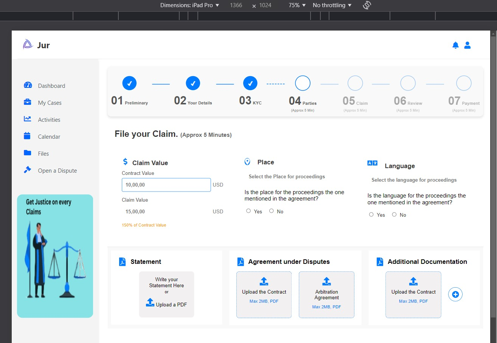
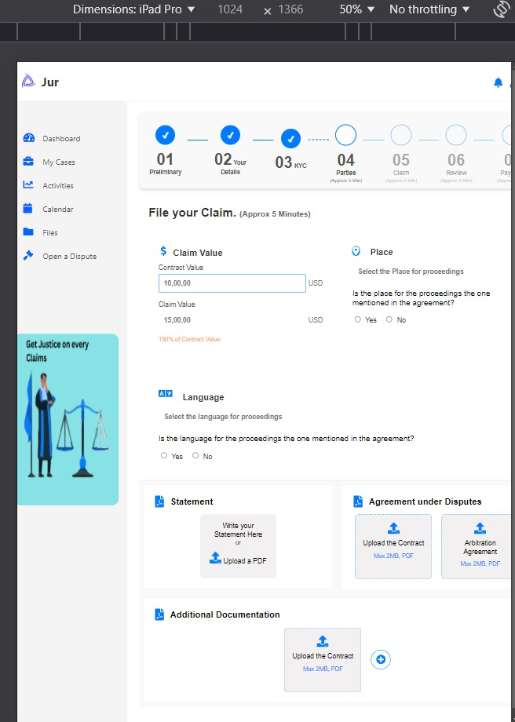

# Dashboard Implementation

## Overview

I create a responsive dashboard using React. The dashboard is designed to guide users through a series of tasks (Preliminary, Your Details, KYC, Parties, Claim, Review, Payment), with a progress bar indicating completion status.

## Approach to Building the Dashboard

1. **Design and Layout**

   - I Utilized a flexible and responsive layout to ensure compatibility across various devices and screen sizes.
   - The design followed a clean and user-friendly structure to display data and navigation intuitively.
   - The CSS `flexbox` model was used for alignment and positioning, ensuring elements like progress bars and steps were properly centered and spaced.

2. **Progress Bar Implementation**

   - Used a combination of React components and modular CSS for the progress bar.
   - The `progress-bar` is implemented as a horizontal step tracker with circles and connecting lines to indicate progress.
   - Added classes like `active`, `completed`, and `dashed` to dynamically style different states of the steps.

3. **Styling with CSS**

   - CSS was used to handle the layout, spacing, and visual styles of the progress bar.
   - Made the progress bar responsive by using media queries for smaller screen sizes (e.g., hiding the lines or adjusting margins).
   - The `line` element's height and positioning were carefully adjusted to stay aligned between circles.

4. **React Logic**

   - Each step was implemented as a separate div with conditionally applied classes (e.g., `completed`, `active`) to reflect the progress dynamically.
   - Used the `dashed` class for incomplete progress to visually differentiate it.
   - Added inline styles where necessary for custom tweaks (e.g., font size, visibility of labels).

## Challenges Faced and Solutions

### 1. **Alignment of Lines Between Circles**

- **Issue**: On larger screens, the lines between the circles would occasionally shift out of alignment, especially when the content grow.
- **Solution**:
  - Used `position: relative` on the `line` and `circle` elements and adjusted the `top` property of the `line` to ensure it remains in the center.
  - Added `flex-shrink: 0` to prevent the circles from shrinking and causing misalignment.
  - Introduced a fixed height and ensured consistent padding around the progress bar.

### 2. **Responsive Design**

- **Issue**: On smaller screens, the progress bar elements (e.g., circles and labels) became too compressed.
- **Solution**:
  - Added media queries to hide the connecting lines and allow wrapping of the steps on smaller screens.
  - Adjusted `min-width` for circles to prevent excessive shrinking.

### 3. **Dynamic Updates in React**

- **Issue**: The state changes for `completed` and `active` steps were not reflected properly in the UI.
- **Solution**: Used React’s `useState` to dynamically apply classes based on progress data. Ensured re-renders by correctly updating state.

## Assumptions Made

1. The dashboard would be primarily used on modern browsers that support CSS Flexbox and media queries.
2. Users would interact with the dashboard sequentially, so the progress bar would be updated step-by-step.
3. The approximate time durations (e.g., 5 minutes) for each step are for display purposes only and do not reflect actual timing functionality.
4. Incomplete steps would not need additional interactivity but should be visually distinguishable.

## Screenshots

### Desktop View



### Tablet View



### Mobile View

<div style="display: flex; justify-content: space-between;">
  
  
</div>

# Getting Started with Create React App

This project was created with [Create React App](https://github.com/facebook/create-react-app).

1. _Clone the repository_:
   bash
   git clone https://github.com/your-repo/Rise11.git
   cd dashboard
2. **Install dependencies**:

   ```bash
   npm install or npm i

   ```

3. _Start the application_:
   ```bash
   npm start
   ```

Runs the app in the development mode.\
Open [http://localhost:3000](http://localhost:3000) to view it in your browser.

The page will reload when you make changes.\
You may also see any lint errors in the console.
